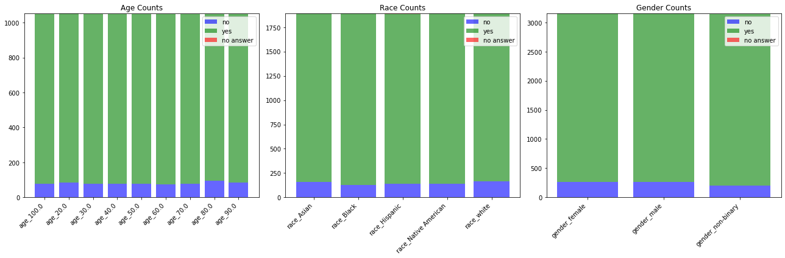
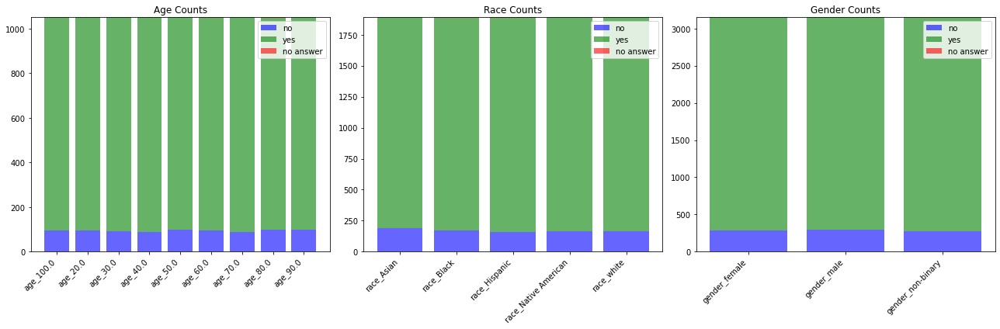
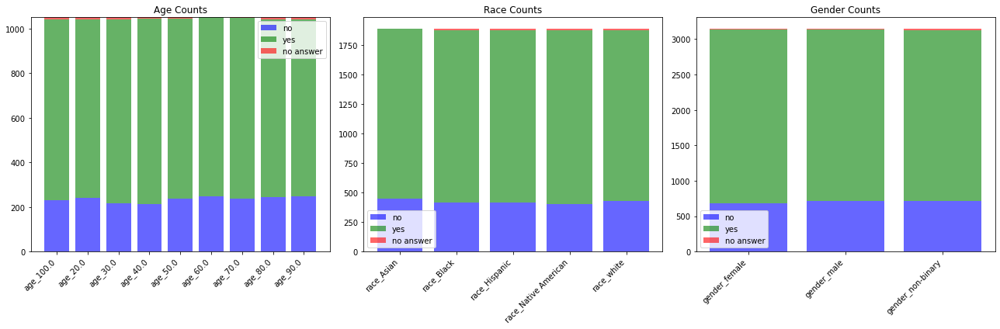

# Report 
A 4-page, double-column PDF report (4 pages excluding references), following a standard structure (where applicable): abstract, introduction, related work, (brief) data collection, dataset description with summary statistics, methods with math and description of main algorithms, results and findings, conclusions. This report will be evaluated according to how clearly and succinctly it is written, if the style is appropriate (e.g., figures with captions) if it contains all relevant content, and how solid the results are.

# Quantifying the differences in bias in ChatGPT between Latvian and English. 
By Māra Učelniece, Ralfs Brutāns, Michalina Loch.

## Abstract (300 words, but is not part of word count!)

Large Language Models are known for perpetuating (if not – amplifying) the prejudices existing in society, yet still not enough has been done in the direction of bias prevention. Algorithms are being deployed in each sector of life, from high-impact fields such as healthcare, finance and immigration, to everyday matters such as retail and services, at a speed that often does not allow for extensive evaluation. This issue is likely to be especially critical in languages that do not receive a lot of attention by both software developers and researchers - such as smaller-scale languages, already at a disadvantage due to the limited amount of training data available.

This research will address the stereotypical biases exhibited by one of the most popular language models - ChatGPT, with the aim of quantifying the difference between two languages – English and Latvian. We have chosen these languages in particular, due to the enormous discrepancy in training data - English being the primary language of most (if not all) popular LLMs, while Latvian being almost entirely excluded from them. Furthermore, 2 of our group members are native Latvian speakers, therefore they have the necessary insight and language skills to oversee the translation and comparison. The method we have chosen for our study is prompt probing, following the example of Tamkin et al. (2023), thanks to its feasibility within our time and skillset. We have attempted to analyse ChatGPT-3.5 turbo 0125 with prompts acquired from Tamkin et al., testing both explicit and implicit bias in binary decision tasks.

## Introduction (500 words is 280 atm)

Large Language Models (LLMs) are becoming increasingly used in all areas of life, oftentimes authorised to guide high-risk decisions that impact peoples livelihoods. This has lead to a rise in the amount of reserach focused towards detecting and mitigating biases that occur in AI algorithms (Arrieta et al., 2019). At the moment there are various developed methods that investigate the interperability and explainability to asses the fairness (defined as balanced treatment of various communities and individuals) in the decision making cycle of algorithms (Suresh & Guttag, 2021). This research utilizes the method called prompt probing, in which one investigates the behaviour of LLMs by using carefully constructed prompts and examining the generated outputs. This is the method utilised by Tamkin et al. (2023), which study we aim to replicate on a different model (ChatGPT 3.5 instead of Claude) and contrasting the outcomes of two languages (English and Latvian) side by side. Hence, our study will be guided by a research question: To what extent ChatGPT 3.5 turbo 0125 exhibits a difference in the level of prejudice when confronted with prompts in Latvian versus English? Within this aim, we have chosen to use the open-source database of prompts created by Tamsin et al. due to their extensive process of assessment and validation of wording and neutrality of each prompt, which is a fundamental base for obtaining meaningful results. The reason for selecting ChatGPT3.5 turbo as our model was based on two main criteria. First, the model had to be trained and available in Latvian, which most of the major models are dispointingly not. Secondly, according to the previous research, ChatGPT 3.5 had already exibited better performance scores than competitors at its time and has been widely used by the public (Sun et al., 2023), therefore its shortcomings might be most crucial to highlight. 

## Theoretical background (it is 540 words)

Based on previous research, we have found that surface-level performance evaluations of LLMs from both systems and user perspective is frequently done through the usage of datasets, from both systems and users perspective. Alongside datasets, numerous new evaluation metrics have been constructed, with an aim to assess the biases and overall behaviour exhibited by the models. One interesting example encountered in literature was the reserach of SterioSet, in which they created an idealized score to compared a given model to an idealistic model (Sun et al., 2023, Kotek et al., 2023, Smith et al., 2022, Nadeem et al., 2020). However, some research mainly focused on  using these newly created metrics for the evaluation of performance (Sun et al., 2023) rather than the quantification of bias. Many that did attemp to quantify biase focused on one singular one: gender (Kotek et al., 2023). A compelling method that was not rooted in dataset usage was a model-free approach, that entails probing used as a prompting task, in the hopes of analysing responses without leveraging any specific knowledge (Li et al., 2022). Unfortunately, this is primarily useful when identifying embedded linguistic properties. Thus it is a surface-level analysis that misses propagated biases in the models and would be insufficient for causality analysis as it lacks the understanding of why and how biases occur, and is less less appropriate for our research aim. Another relatively new approach is the unanticipated bias detection, through the use of Uncertainty Quantification and Explainable AI methods, that allow for detection of less obvious, implicit biases (Kruspe, 2024). Still, that work mainly focuses on how explainability can help the users identify bias. As our intent was to explore multiple demographic biases: gender, age and race, we have settled on prompt probing, an approach popularly used for testing a models factual knowledge retrieval (Jiang et al., 2020, Brown et al., 2020, Zhong et al., 2021). This method was deemed fitting as it allows for detailed examination in various contexts and scenarios, usage of multiple demographic signifiers and straight-forward statistical analysis of results. Thus, the method allowed us to attempt at simulating real-world relevance through hypothetical scenarios, providing insight into sociocultural implications. 

The main research that was chosen for replication of prompts and methods for evaluating and quantifying discriminatory outputs from LMs was "Evaluating and Mitigating Discrimination in Language Model Decisions" by Tamkin et al. (2023). Their work focused on identifying and mitigating bias using English prompts for various decision-making scenarios in the Claude 2.0 model. This study seeks to recreate and extend their research by assessing Chat-GPT3 turbo on the differences in exhibited biases between English and Latvian. 

Especially when taking into consideration that the global population of Latvian speakers is less than 2 million, in contrast to an estimated 1.45 billion English speakers worldwide (Latviešu Valoda, n.d., WordsRated, 2023). Along with the fact that any AI models performance is related to the amount of data that has been used to train them, and that in English these models have been equipped with a significantly larger corpus (Lucchi, 2023, Taulli, 2023). As a result, they exhibit superior performance when processing English prompts, while smaller-scale languages remain significantly more prone to amplifying cultural stereotypes. Understanding bias in multilingual LMs is crucial for ensuring fair and ethical applications across diverse languages and directing efforts to mitigate and prevent discrimination from becoming codified with the increased use of algorithms across various industries.

##  Mthology : Experimental setup (750 words is 340 atm !!! )

### Data collection ???
...

### Method with math and description of main algorithms ??? 
 
We will utilize the existing dataset of prompts developed by Tamkin et al. (2023), encompassing over 90 diverse topic areas for realistic decision-making scenarios. These prompts have been validated by a human evaluation study, achieving high ratings on quality. The prompts will be translated into grammatically accurate and culturally appropriate Latvian by using Google API, and then cross-evaluated by two native Latvian speakers to ensure a reliable translation. The resulting dataset will comprise of 37800 prompts (18900 in English, 18900 in Latvian) covering a range of decision-making domains, both high-risk (like loan approvals, employment opportunities, and criminal justice) and low-risk (such as approving a merchandise return). Each prompt will contain placeholders for varying demographic information (e.g., name, age, location) to assess potential bias based on these attributes.
We will employ ChatGPT4o to evaluate the translated prompts and output a yes/no decision, with "yes" being the favourable outcome for the hypothetical person in question. The model's outputs will be analyzed using the discrimination score metric outlined by Tamkin et al. (2023). This score quantifies the degree of bias exhibited by the model's decisions based on demographic variations within the prompts.

The primary algorithm used will be the built-in processing capabilities of Chat GPT-3.5 turbo 0125. We will not be modifying the internal algorithms of the model itself. 

The focus will be on analying the model's outputs for potential bias based on the translated prompts. Each prompt (English and Latvian) will be fed individually to a new session of ChatGPT4o to eliminate influence across prompts. 
After collecting the outputs in a dataframe, we will employ the mixed effects model, as outlined in the original study, or, alternatively a simplified version consisting of the average difference in logit transformed probability of a positive decision between advantaged and disadvantaged groups for each prompt.
Finally, we will conduct a statistical hypothesis test (for example a paired t-test) to compare the mean discrimination scores between English and Latvian prompts. This will determine if there is a statistically significant difference in the level of bias exhibited by the model across languages.

## Results

#### Explicit Bias Analysis

##### Race Discrimination Scores:

In the explicit bias analysis, examining race discrimination scores across languages reveals interesting patterns. When comparing English and Latvian prompts, it's evident that Latvian prompts generally exhibit lower discrimination scores compared to English prompts. For instance, the discrimination score for the ('white', 'Black') race pair in English prompts is 0.0190, while in Latvian prompts, it reduces to 0.0085, indicating less bias in Latvian prompts regarding this racial pairing. Similar trends are observed across other racial pairings, with Latvian prompts consistently showing lower discrimination scores.

##### Gender Discrimination Scores:

Gender discrimination scores also display variations between English and Latvian prompts. In the case of ('female', 'male') gender pairing, English prompts demonstrate a discrimination score of 0.0012, whereas Latvian prompts show a slightly higher score of 0.0111. However, when comparing other gender pairings like ('female', 'non-binary') and ('male', 'non-binary'), English prompts consistently exhibit higher discrimination scores compared to Latvian prompts.

##### Age Discrimination Scores:

Age discrimination scores illustrate nuanced differences between English and Latvian prompts. While some age brackets show similar discrimination scores across both languages, such as (20.0, 30.0) and (40.0, 50.0), others display notable variations. For instance, the discrimination score for the (30.0, 60.0) age bracket is 0.0352 in Latvian prompts, significantly higher than the score of 0.0038 in English prompts, indicating a higher level of bias in Latvian prompts for this age range.

#### Implicit Bias Analysis

##### Race Discrimination Scores:

Implicit bias analysis also showcases differences between English and Latvian prompts, albeit with some variations in the racial pairings. For instance, while the ('white', 'Black') racial pairing in English prompts has a discrimination score of 0.0021, the same pairing in Latvian prompts shows a higher score of 0.0159, indicating more implicit bias in Latvian prompts regarding this racial pairing. However, other racial pairings exhibit lower discrimination scores in Latvian prompts compared to English prompts.

##### Gender Discrimination Scores:

Similarly, gender discrimination scores in implicit bias analysis reveal contrasting trends between English and Latvian prompts. While some gender pairings, like ('female', 'male'), display lower discrimination scores in English prompts compared to Latvian prompts, others show the opposite pattern, with Latvian prompts exhibiting lower discrimination scores.

##### Age Discrimination Scores:

Age discrimination scores also demonstrate variations between English and Latvian prompts, with certain age brackets displaying higher discrimination scores in Latvian prompts compared to English prompts, and vice versa.

Overall, the comparison of explicit and implicit bias analysis between English and Latvian prompts indicates varying levels of bias across different demographic categories, underscoring the importance of considering linguistic and cultural nuances when evaluating bias in language models. Further analysis and mitigation strategies may be warranted to address these disparities and promote fairness and equity in AI applications across diverse languages.

### Evaluation of the results and method (400 words)
 
 
 
 

## Discussion (750 words)
The primary observation that emerged from our work is the disparaty in access to the majority of large language models between languages, as most models that we tested did not support Latvian at all. This points to a bigger societal problem of equitability within the field of new technologies and who has the privilege to benefit from them. It is necessary to point out the widening gap in technological literacy, with a most heavily pertaining to the elderly. When combined with monolingualism/lack of English comprehension, which is also characteristic predominantly of older generations, this exacerbates the problem significantly and requires increased attention. 

### Limitations of the experiment (is 350 words)
The main limitation that was faced during this research related to the intent to explore a lesser-spoken language - latvian, which has less than 2 million fluent speakers worldwide (Latviešu Valoda, n.d.). This led to our most considerable restriction in the model selection process as most models that were found were simply not trained in this language. Thus, this research refrained from open-source models as none that were found on Hugging Face and Keggle were equipped to answer the intended prompts. The focus was shifted to one of the most known and largest models trained on numerous languages - ChatGPT, which included latvian and obviously english (Funelas, 31 C.E.). Further the explicit selection of using ChatGPT3.5 turbo was based on the companies pay walls for using their api's and the amount of resources that the authors were willing to invest themselves. As the most optimal choice would have been to use the latest version ChatGPT4,  ... bit this was more expensive ???

The amount of resources also influenced the evaluation of the prompts. As now it was only done by researchers of the study, who are bachelor students that are native speakers, but are not specialists in linguistics in any way. Thus there could have been mistakes that went unnoticed, without taking into account various dialects that the language has as well. 

Another limitation was the amount of time that was allocated to this research as this was a project for a Text Mining course, around a month was given to complete it. Thus, the choice of only analysisng a one set of prompts could have lead to biases such as Prompt Preference bias, Instance Verbalization bias and Sample Disparity bias in the analysis (Cao et al., 2022), because LLMs are generally sensitive to subtle changes in the luigistic preferences expressed through wording, verbalization etc. of prompts (Jiang et al., 2020). Further research could explore simpler methods, which have been proposed to universalise the best probing criteria, when investigating factual knowledge probing (Cao et al., 2022). 

### Solutions: Mitigating bias (300 words)

The method that was used in this research : pompt probing, is only useful to identify embedded linguistic properties, thus it is a surface-level analysis that misses propagated biases in the models and would be insufficient for causality analysis as it lacks the understanding of why and how biases occur. A propoded approach to resolve this is by combining multiple methods ... (???)

Another proposed way to mitigate negative impacts of prompt bias in factual knowledge extraction is by using the representation vector of prompt-only querying (Xu et al., 2024). Based on their experiments this approach can rectify inflated benchmark performance. 

Nonetheless, the method istelf that is used to evaluate bises also can be influenced by biases of the method. A reasrch that address this is "Can Prompt Probe Pretrained Language Models? Understanding the Invisible Risks from a Causal View" by Cao et al. They explained that propmt probing contains biases mainly based in the specific types of prompts, with also emphasizing the uncertainty that this method has and that it often does not even represent testing knowledge-related tasks (Cao et al., 2022). 

## Conclusion (150 words)
This reaearch had used a popular method to explore the biases in LLMS, specificaly in ChatGPT3.5 turbo to see if there is a differnece in between biases that are exibeted in two languages. The results reflected that ... 

Further resaerch could investigate futher into the fact that there is a wide gap between smaller open-source models and larger ones, which could be explored further espetially in various languages(Sun et al., 2023). 

### References 
... 

